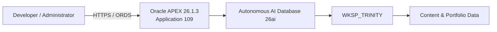
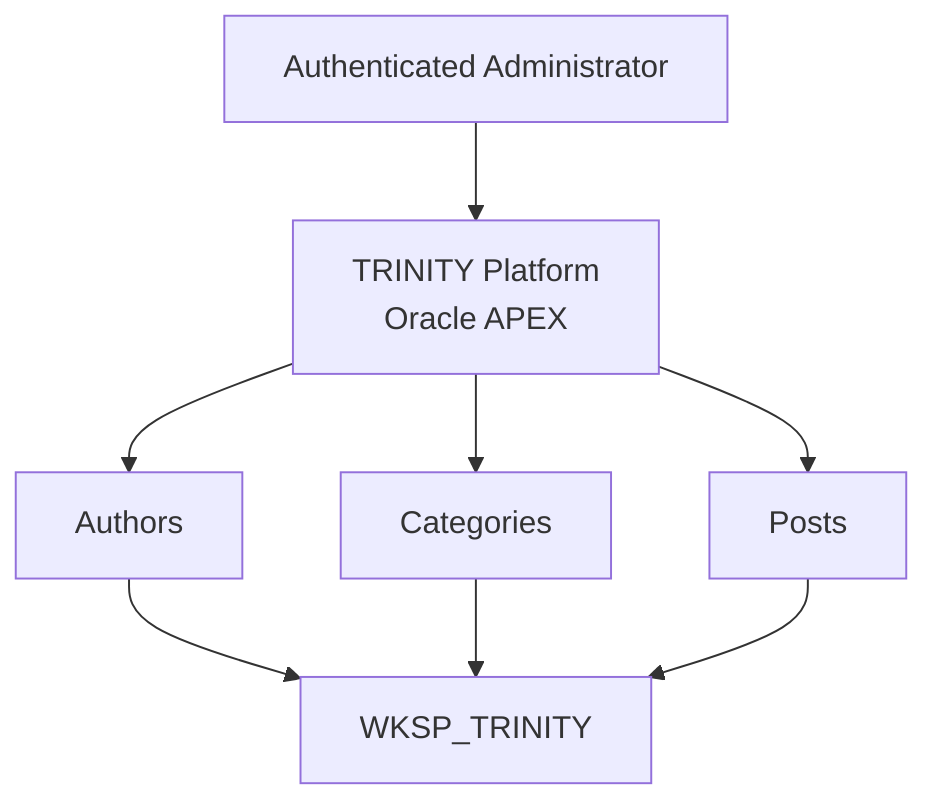
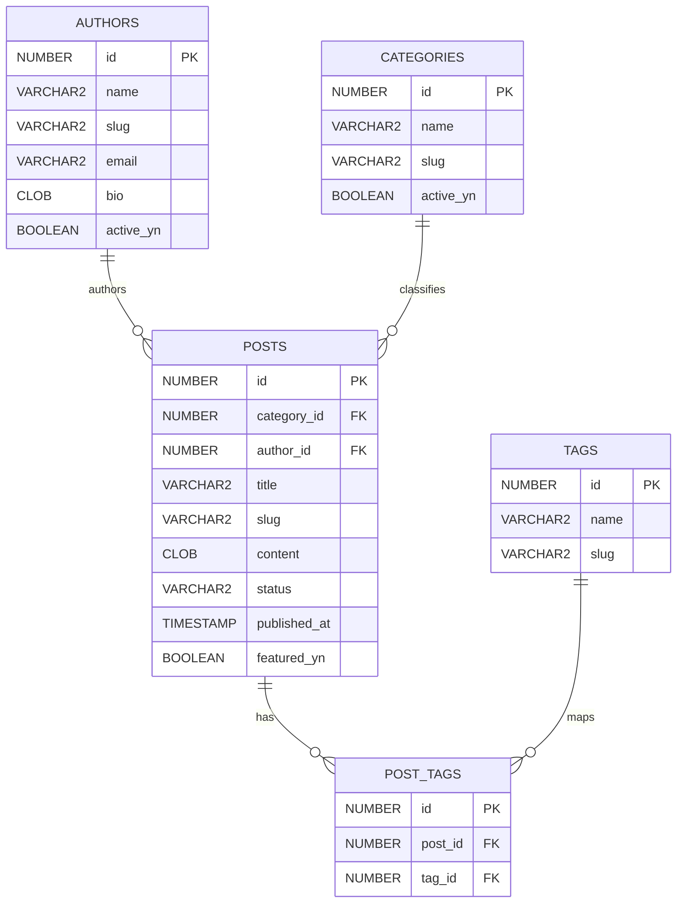

# TRINITY Platform

**Oracle APEX + Autonomous AI Database 26ai on Oracle Cloud Infrastructure**

TRINITY is a personal engineering platform focused on Oracle technologies, technical publishing, and hands-on experimentation with modern Oracle Database and application development capabilities.

The project is being developed as a real, version-controlled implementation rather than a demonstration-only repository. Its current baseline combines a relational data model, Oracle APEX application source, automated auditing, administrative content management, and architecture documentation.

> **Project status:** Active development<br>
> **Current baseline:** Oracle APEX administrative CMS + Autonomous AI Database 26ai<br>
> **Primary purpose:** Professional engineering portfolio, Oracle platform development, and technical publishing

---

## Engineering Snapshot

| Area | Current implementation |
|---|---|
| Cloud platform | Oracle Cloud Infrastructure |
| Database | Oracle Autonomous AI Database 26ai |
| Database workload | APEX |
| Application layer | Oracle APEX 26.1.3 |
| APEX application | TRINITY Platform |
| Application ID | 109 |
| Parsing schema | `WKSP_TRINITY` |
| Database model | 7 tables |
| Database indexes | 4 |
| Audit triggers | 7 |
| APEX pages | 9 |
| APEX page items | 38 |
| APEX processes | 12 |
| APEX regions | 15 |
| APEX buttons | 16 |
| Dynamic Actions | 3 |
| Shared LOVs | 3 |
| Source control | Git + GitHub |

The APEX application export and database DDL in this repository are direct engineering artifacts from the current TRINITY implementation.

---

## Architecture at a Glance



The current solution uses the APEX workload of Autonomous AI Database and does **not** require a separate OCI Compute instance for the implemented baseline.

### Current application scope



---

## Current Capabilities

### Implemented

- Relational content model designed with Oracle Quick SQL.
- Oracle DDL for authors, categories, posts, tags, post/tag relationships, events, and certifications.
- Identity-based primary keys.
- Foreign-key relationships between posts, authors, categories, and tags.
- Supporting indexes for relational access paths.
- Automatic `CREATED`, `CREATED_BY`, `UPDATED`, and `UPDATED_BY` auditing.
- Oracle APEX administrative pages for Authors, Categories, and Posts.
- List of Values integration for author and category relationships.
- Controlled post lifecycle using `DRAFT`, `PUBLISHED`, and `ARCHIVED` states.
- Automatic URL-friendly slug generation from post titles using an APEX Dynamic Action.
- Oracle APEX Accounts authentication.
- Application-level authorization component for administration.
- Source-controlled Oracle APEX application export.
- Controlled architecture portfolio covering OCI topology, use cases, data model, database implementation, APEX publishing flow, and delivery roadmap.

### In progress

- Public-facing publishing experience.
- Expanded technical documentation for repeatable deployment.
- Additional content-management capabilities.

### Planned

- Public Home, Blog, Article, Categories, About, and Contact experiences.
- Administrative interfaces for Tags, Events, and Certifications.
- Media management using OCI Object Storage where appropriate.
- Custom domain and OCI DNS integration.
- Additional security hardening and least-privilege review.
- Expanded observability and operational documentation.

Planned capabilities are intentionally separated from the current implementation so that this repository reflects the actual state of the project.

---

## Data Model

The current database baseline contains seven tables:

| Table | Responsibility |
|---|---|
| `AUTHORS` | Author profile and publishing identity |
| `CATEGORIES` | Content classification |
| `POSTS` | Primary article and publishing content |
| `TAGS` | Reusable content tags |
| `POST_TAGS` | Many-to-many association between posts and tags |
| `EVENTS` | Technical events and activities |
| `CERTIFICATIONS` | Professional certification records |

### Core relationships



`EVENTS` and `CERTIFICATIONS` are currently standalone entities in the v1 database baseline.

---

## Database Engineering

The schema was generated from a Quick SQL model and implemented as Oracle DDL.

The current DDL includes:

- 7 `CREATE TABLE` statements.
- 4 supporting indexes.
- 7 `BEFORE INSERT OR UPDATE` audit triggers.
- Identity-generated numeric primary keys.
- Foreign-key constraints for the core publishing model.
- Oracle `BOOLEAN` columns for applicable state flags.

The audit triggers resolve the application user from the APEX session when available:

```sql
coalesce(sys_context('APEX$SESSION','APP_USER'), user)
```

This provides application-aware attribution while retaining a database-user fallback outside an APEX session.

---

## Oracle APEX Implementation

The source-controlled APEX export is:

```text
apex/exports/f109.sql
```

The current export identifies:

- Application 109 — **TRINITY Platform**
- Oracle APEX 26.1.3
- Parsing schema `WKSP_TRINITY`
- 9 pages
- 38 page items
- 12 processes
- 15 regions
- 16 buttons
- 3 Dynamic Actions
- 3 shared Lists of Values
- Authentication and authorization components
- Supporting Objects included in the application export

### Administrative application

The implemented administrative scope currently includes:

```text
Home
├── Posts
│   └── Post
├── Categories
│   └── Category
└── Authors
    └── Author
```

A dedicated Login page and Global Page are also part of the application export.

### Slug generation

The Post form contains an APEX Dynamic Action that derives a normalized URL-friendly slug from the title.

The implementation:

1. Reads the value of `P3_TITLE`.
2. Normalizes accented characters.
3. Converts the title to lowercase.
4. Replaces non-alphanumeric sequences with hyphens.
5. Removes leading and trailing hyphens.
6. Writes the result into `P3_SLUG`.

This behavior is stored as application source inside `f109.sql`.

---

## Repository Structure

```text
Trinity/
├── README.md
├── .gitignore
│
├── apex/
│   ├── README.md
│   └── exports/
│       └── f109.sql
│
├── database/
│   ├── README.md
│   ├── ddl/
│   │   └── TRINITY_V1_SCHEMA.sql
│   └── quicksql/
│       └── trinity-v1.quicksql
│
├── docs/
│   ├── architecture/
│   │   ├── README.md
│   │   ├── 01-physical-oci-topology-trinity-v1.png
│   │   ├── 02-use-case-diagram-trinity.png
│   │   ├── 03-erd-trinity-v1-schema.png
│   │   ├── 04-database-implementation-ddl-dml.png
│   │   ├── 05-apex-dml-publishing-flow.png
│   │   └── 06-delivery-roadmap-trinity.png
│   └── decisions/
│       └── ADR-001-platform-baseline.md
│
└── assets/
    └── README.md
```

The repository deliberately separates executable source, database artifacts, architecture documentation, and engineering decisions.

---

## Source Artifacts

### `database/quicksql/trinity-v1.quicksql`

The original Quick SQL model used to define the v1 relational baseline.

### `database/ddl/TRINITY_V1_SCHEMA.sql`

Generated and executed Oracle DDL containing the physical schema, indexes, constraints, and automatic audit triggers.

### `apex/exports/f109.sql`

Standard Oracle APEX application export intended for source control.

Oracle-generated APEX export files should be treated as generated source artifacts and should not be manually edited without a specific technical reason.

---

## Reproducibility Notes

TRINITY is being organized so that its database and APEX application sources can be independently reviewed and versioned.

At a high level, a compatible Oracle environment would require:

1. An Oracle Database environment supporting the database features used by the schema.
2. Oracle APEX compatible with the application export.
3. A target workspace and parsing schema.
4. Deployment of the database model.
5. Import and validation of the Oracle APEX application.

Environment-specific installation instructions will be documented separately as the deployment process is formalized.

> Do not execute repository SQL against a production environment without first reviewing the schema, target owner, application mappings, and deployment impact.

---

## Architecture Decisions

Significant engineering choices are documented using Architecture Decision Records.

The first baseline decision is stored at:

```text
docs/decisions/ADR-001-platform-baseline.md
```

The ADR documents the current OCI + Autonomous AI Database + Oracle APEX baseline and separates implemented architecture from future enhancements.

---

## Engineering Principles

TRINITY follows several baseline principles:

- **Evidence over claims** — implemented functionality is separated from planned functionality.
- **Database-first integrity** — relationships and business data are modeled explicitly.
- **Source control by default** — database and APEX sources are preserved in Git.
- **Traceable architecture** — important technical decisions are documented.
- **Security by design** — secrets, private keys, tokens, session identifiers, and environment credentials must not be committed.
- **Minimal operational footprint** — infrastructure is added only when the implementation requires it.
- **Professional documentation** — repository content should be understandable without relying on undocumented project history.

---

## Security

This repository is intended to contain application source and technical documentation only.

The following information must never be committed:

- OCI private keys.
- API signing keys.
- Passwords or authentication secrets.
- Access tokens.
- Active APEX session identifiers.
- Environment-specific credentials.
- Sensitive personal information.
- Screenshots containing confidential account data.

Before each public release, repository contents should be reviewed for accidental secret exposure.

---

## Roadmap

The current engineering direction is:

```text
Database baseline
        ↓
APEX administrative CMS
        ↓
Source-controlled application
        ↓
Public publishing experience
        ↓
Media and delivery enhancements
        ↓
Operational hardening
```

Roadmap items describe direction rather than completed functionality.

---

## Author

**Florentino López**

Oracle technology practitioner focused on Oracle Database, Oracle APEX, Autonomous AI Database, Oracle Cloud Infrastructure, data engineering, and practical application architecture.

GitHub: [@tinuslopez](https://github.com/tinuslopez)

---

## Project Notice

TRINITY is an independent personal engineering project.

Oracle, Oracle Database, Oracle APEX, Oracle Cloud Infrastructure, and related product names are trademarks or registered trademarks of Oracle and/or its affiliates. This repository is not an Oracle product and does not represent an official Oracle implementation or endorsement.
