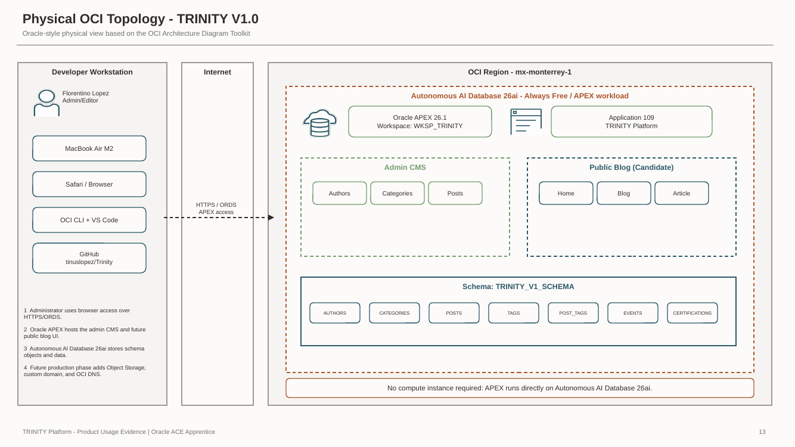
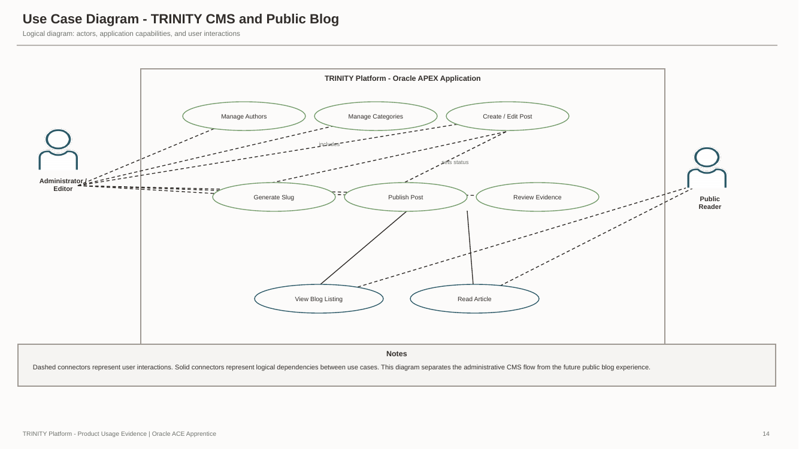
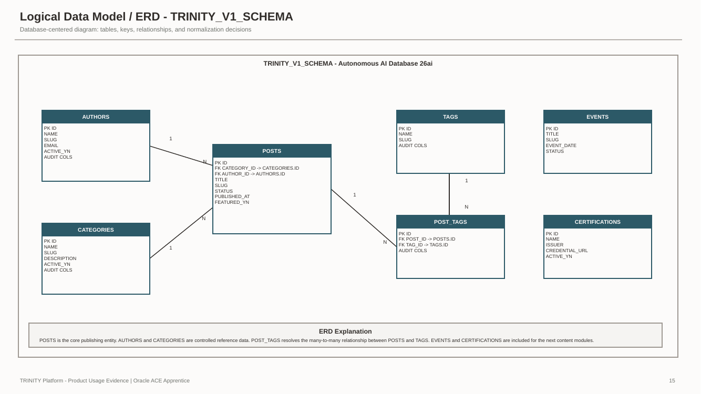
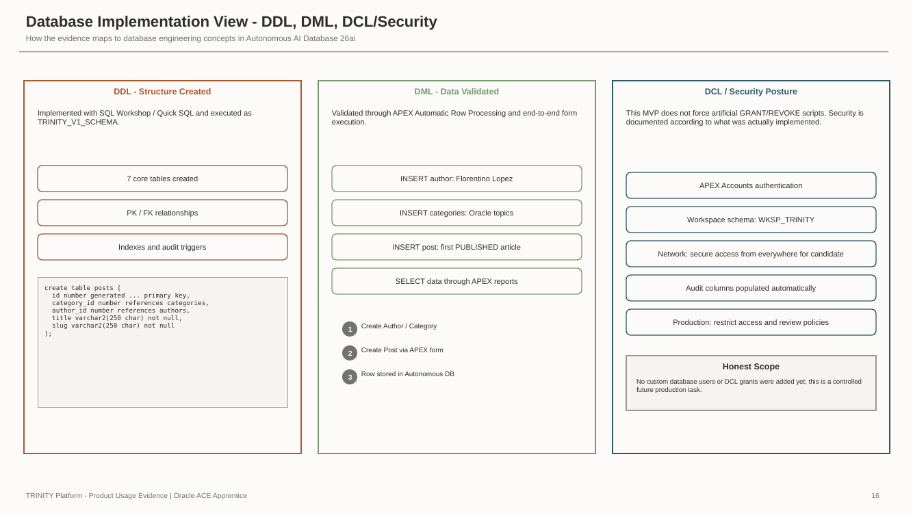
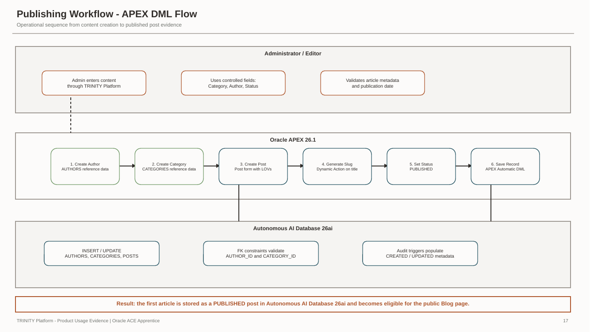
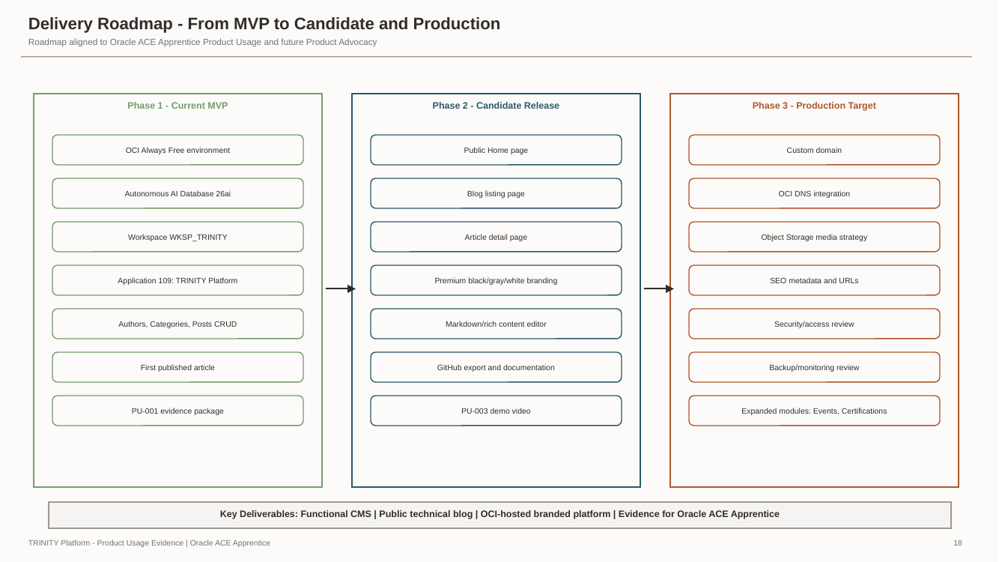

# TRINITY Platform — Architecture

**Architecture documentation for the TRINITY Platform v1 engineering baseline**

This directory contains the controlled architecture diagram set for TRINITY Platform.

The diagrams document the platform from six complementary viewpoints: physical OCI topology, functional use cases, relational data model, database implementation, Oracle APEX publishing flow, and delivery roadmap.

The documentation deliberately distinguishes between:

- **Current** — implemented and demonstrable.
- **In progress** — actively being developed.
- **Planned** — future capabilities that must not be interpreted as deployed.

---

## Architecture Baseline

The current runtime baseline is:

```text
Oracle Cloud Infrastructure
        │
        ▼
Oracle Autonomous AI Database 26ai
APEX workload
        │
        ▼
Oracle APEX 26.1.3
Application 109 — TRINITY Platform
        │
        ▼
Parsing Schema — WKSP_TRINITY
```

A dedicated OCI Compute instance is not required for the current v1 implementation.

---

## Diagram Portfolio

### 01 — Physical OCI Topology



**File:** `01-physical-oci-topology-trinity-v1.png`

Shows the current physical solution topology and the separation between the local developer / administrator environment and the Oracle Cloud Infrastructure runtime.

The diagram represents the implemented baseline:

- Oracle Cloud Infrastructure.
- Region `mx-monterrey-1`.
- Oracle Autonomous AI Database 26ai.
- APEX workload.
- Oracle APEX 26.1.
- TRINITY Platform Application 109.
- Parsing schema `WKSP_TRINITY`.
- Current administrative CMS and database layer.

Future components are visually separated from the current deployed baseline.

---

### 02 — Use Case Diagram



**File:** `02-use-case-diagram-trinity.png`

Shows the primary actors and functional interactions with TRINITY Platform.

The purpose of this diagram is to communicate system behavior from a functional perspective rather than an infrastructure perspective.

---

### 03 — Entity Relationship Diagram



**File:** `03-erd-trinity-v1-schema.png`

Shows the v1 relational model implemented in Oracle Autonomous AI Database 26ai.

The database baseline contains:

```text
AUTHORS
CATEGORIES
POSTS
TAGS
POST_TAGS
EVENTS
CERTIFICATIONS
```

Core relationships:

```text
AUTHORS       1 ───────────< POSTS

CATEGORIES    1 ───────────< POSTS

POSTS         1 ───────< POST_TAGS >─────── 1 TAGS
```

`EVENTS` and `CERTIFICATIONS` are currently standalone entities.

The physical implementation includes:

```text
7 tables
4 supporting indexes
7 audit triggers
```

---

### 04 — Database Implementation: DDL and DML



**File:** `04-database-implementation-ddl-dml.png`

Shows how the logical database design becomes an implemented Oracle Database structure and how application data operations interact with that structure.

The database implementation includes:

- Identity-generated primary keys.
- Foreign-key relationships.
- Supporting indexes.
- Oracle `BOOLEAN` state columns where applicable.
- Standard audit columns.
- Automatic audit triggers.
- DML initiated through Oracle APEX page processing.

Database source artifacts are maintained under:

```text
database/
├── quicksql/
│   └── trinity-v1.quicksql
└── ddl/
    └── TRINITY_V1_SCHEMA.sql
```

---

### 05 — Oracle APEX DML Publishing Flow



**File:** `05-apex-dml-publishing-flow.png`

Shows the implemented administrative content flow through Oracle APEX.

At a high level:

```text
Administrator
      │
      ▼
Oracle APEX Form
      │
      ├── Author LOV
      ├── Category LOV
      ├── Title
      ├── Slug Dynamic Action
      ├── Content
      └── Publication Status
      │
      ▼
APEX Page Processing
      │
      ▼
POSTS
      │
      ▼
Database Audit Trigger
```

This diagram connects Oracle APEX application behavior with the database implementation.

---

### 06 — TRINITY Delivery Roadmap



**File:** `06-delivery-roadmap-trinity.png`

Shows the staged evolution of TRINITY from the current engineering baseline toward broader public and production-oriented capabilities.

Roadmap elements represent direction, not completed functionality.

---

## Architecture Views

| Diagram | Architectural view | Primary question |
|---|---|---|
| 01 Physical OCI Topology | Physical / deployment | Where does TRINITY run? |
| 02 Use Case Diagram | Functional | Who interacts with TRINITY and how? |
| 03 ERD | Data | How is TRINITY data structured? |
| 04 Database Implementation | Database engineering | How is the data model physically implemented? |
| 05 APEX Publishing Flow | Application / data flow | How does content move through APEX into Oracle Database? |
| 06 Delivery Roadmap | Evolution | How will TRINITY progress beyond the current baseline? |

Together, these views provide a complete technical narrative without forcing one diagram to explain the entire system.

---

## Current Architecture

The current OCI-hosted runtime is intentionally compact:

```text
Oracle Cloud Infrastructure
Region: mx-monterrey-1
│
└── Autonomous AI Database
    │
    ├── Database version: 26ai
    ├── Workload: APEX
    ├── Service tier: Always Free
    │
    └── Oracle APEX
        │
        └── Application 109
            TRINITY Platform
```

The developer workstation and GitHub repository remain outside the OCI runtime boundary.

---

## Application Responsibilities

Oracle APEX currently owns application-layer responsibilities including:

- Authentication.
- Authorization.
- Navigation.
- Reports.
- Forms.
- Shared Lists of Values.
- Page validations.
- Dynamic Actions.
- Page processing.
- Publication-state selection.
- Client-side slug generation.

The current administrative scope includes:

```text
Home
Posts
Post
Categories
Category
Authors
Author
Login
Global Page
```

---

## Database Responsibilities

Oracle Autonomous AI Database currently owns:

- Persistent relational storage.
- Primary keys.
- Foreign keys.
- Identity-generated identifiers.
- Supporting indexes.
- Automatic audit columns.
- Audit triggers.
- Relational integrity defined in the v1 schema.

The current parsing schema is:

```text
WKSP_TRINITY
```

The SQL script artifact is:

```text
TRINITY_V1_SCHEMA.sql
```

These are distinct concepts and are intentionally documented separately.

---

## Audit Strategy

Each database entity contains:

```text
CREATED
CREATED_BY
UPDATED
UPDATED_BY
```

The audit triggers resolve the active Oracle APEX user when available and otherwise use the database user.

Representative logic:

```sql
coalesce(
    sys_context('APEX$SESSION','APP_USER'),
    user
)
```

---

## Source-Control Traceability

TRINITY treats architecture documentation as part of the engineering baseline.

The implementation chain is:

```text
Quick SQL
    │
    ▼
Relational Model
    │
    ▼
Generated Oracle DDL
    │
    ▼
Autonomous AI Database 26ai
    │
    ▼
Oracle APEX Application 109
    │
    ▼
Standard APEX Export
    │
    ▼
Git
    │
    ▼
GitHub
```

Relevant source paths:

```text
database/quicksql/trinity-v1.quicksql
database/ddl/TRINITY_V1_SCHEMA.sql
apex/exports/f109.sql
```

---

## Architecture Decision Record

The platform baseline decision is documented in:

```text
docs/decisions/ADR-001-platform-baseline.md
```

ADR-001 explains why the current implementation uses Oracle Autonomous AI Database 26ai with the APEX workload and why dedicated OCI Compute is not part of the current v1 baseline.

---

## Visual Standard

TRINITY architecture diagrams use a restrained Oracle-oriented visual language.

The project follows these principles:

- Oracle Redwood-inspired neutral backgrounds.
- Oracle Ocean and Sienna for OCI architectural emphasis.
- Official OCI service iconography where appropriate.
- Clear distinction between local, OCI, application, and database boundaries.
- Explicit component labels.
- No decorative infrastructure that is not actually implemented.
- Planned components must be visually distinguishable from current-state components.

The diagrams are technical communication artifacts, not decorative illustrations.

---

## Diagram Governance

Before a diagram is changed, verify that:

1. Every current-state component actually exists.
2. Planned components are clearly labeled as planned.
3. OCI service names remain correct.
4. The current region and runtime boundaries remain accurate.
5. `WKSP_TRINITY` is identified as the parsing schema.
6. `TRINITY_V1_SCHEMA.sql` is identified as a SQL artifact, not as the schema owner.
7. Application responsibilities are not confused with database responsibilities.
8. Sensitive information such as OCIDs, credentials, private URLs, and active sessions is absent.
9. Labels remain readable at normal GitHub viewing size.
10. The diagram remains consistent with the repository source and ADRs.

---

## Current vs. Planned

### Current

```text
OCI
└── Autonomous AI Database 26ai
    └── Oracle APEX
        └── Application 109
            ├── Administrative CMS
            └── WKSP_TRINITY
```

### In progress

```text
Public publishing experience
Expanded architecture documentation
Deployment documentation
Additional content-management capabilities
```

### Planned

Potential future enhancements include:

```text
OCI Object Storage
Custom domain
OCI DNS
Additional public pages
Additional administration modules
Expanded observability
Operational hardening
```

These are roadmap items until implemented.

---

## Repository Integration

Architecture diagrams are stored together with this README:

```text
docs/architecture/
├── README.md
├── 01-physical-oci-topology-trinity-v1.png
├── 02-use-case-diagram-trinity.png
├── 03-erd-trinity-v1-schema.png
├── 04-database-implementation-ddl-dml.png
├── 05-apex-dml-publishing-flow.png
└── 06-delivery-roadmap-trinity.png
```

This naming convention provides deterministic ordering, readable GitHub paths, lowercase filenames, and direct Markdown compatibility.

---

## Review Audience

The architecture portfolio is designed to be understandable by:

- Oracle technology professionals.
- Database professionals.
- Oracle APEX developers.
- Solution architects.
- Technical hiring managers.
- Future collaborators.

The objective is not to make the repository look complex.

The objective is to make the engineering **clear, traceable, accurate, and professionally presented**.
